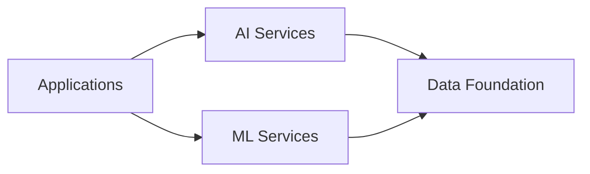

## 1. Historical Context of Data Science
- **Ockham's Razor (1300s)**: Principle favoring simpler ML solutions
- **Tobias Mayer (Mid-1700s)**: First true data scientist; established quantitative argument for more data = better accuracy
- **Arthur Samuel (1952)**: Coined "machine learning"; demonstrated learning through experience (checkers AI)
- **John W. Tukey (1962)**: Predicted impact of electronic computing on data analysis
- **Deep Blue (1997)**: IBM supercomputer defeating chess grandmaster; demonstrated large-scale position calculation (100-200B positions/3min)
- **Data Science Term (2008)**: Coined by Dr. DJ Patil (LinkedIn) and Jeff Hammerbacher (Facebook) to describe extracting value from business data
- **Modern Use Case (2021)**: Predictive modeling for "The Great Resignation" (employee attrition)

## 2. Oracle's AI/ML Framework

### Layers:
1. **Data Foundation**: 
   - Structured + unstructured data sources (sensors, mobile apps, social media, voice/text, videos, images, documents)
   - Required for all AI/ML operations

2. **Machine Learning Services**:
   - For data scientists to build, train, deploy, and manage models
   - Includes:
     - OCI Data Science (core focus)
     - ML algorithms in Oracle Database
     - OCI Data Labeling (supports image/text/speech models)

3. **AI Services**:
   - Pre-built ML models for specific uses
   - Two types:
     - Pre-trained models
     - Customer-trained models (using proprietary data)
   - Consumption via API calls (no infrastructure management)

4. **Supporting Services**:
   - Business Analytics
   - Graph Analytics
   - Data Integration
   - Data Management
   - OCI infrastructure services

## 3. OCI Data Science Core Principles
1. **Accelerate Individual Productivity**:
   - Native Python/open-source support
   - Pre-installed libraries + ability to add custom libraries
   - Dynamic compute scaling (CPU/GPU) without infrastructure management
   - Includes Oracle's Accelerated Data Science SDK (ADS)

2. **Team Collaboration**:
   - Shared assets across projects
   - Reproducibility and auditability of models
   - Reduced duplicate work

3. **Enterprise-Grade Operations**:
   - Integrated OCI security (IAM, VCN, policies)
   - Fully managed infrastructure
   - Automated maintenance, patching, and upgrades
   - Compliance with enterprise governance standards

## 4. Key Components & Terminology
| **Term**                | **Technical Description**                                                                 |
|-------------------------|-------------------------------------------------------------------------------------------|
| **Projects**            | Collaborative workspaces organizing data science assets (no tenancy limits)               |
| **Notebook Sessions**   | Managed JupyterLab environments with pre-installed OSS libraries; customizable compute shapes (CPU/GPU) and storage |
| **Conda**               | Open-source environment/package manager for Python; handles dependency management and environment switching |
| **ADS SDK**             | Oracle's Python library automating DS workflow: data connection, AutoML, model evaluation/explanation, OCI service integration |
| **Models**              | Mathematical representations of data/business logic; built in notebook sessions           |
| **Model Catalog**       | Centralized repository for model artifacts (metadata, Git provenance, training scripts) enabling versioning and sharing |
| **Model Deployments**   | HTTP endpoints for real-time prediction serving on managed infrastructure                 |
| **Data Science Jobs**   | Repeatable ML tasks executed on managed infrastructure (batch processing)                 |

## 5. Access Methods
1. **OCI Console**: Browser-based UI for notebook sessions and service management
2. **REST API**: Programmatic control (documented in product reference)
3. **Language SDKs**: Java, Python, TypeScript, JavaScript, .NET, Go, Ruby
4. **CLI**: Command-line interface for scripting-free operations

## 6. Global Infrastructure
- **Regions**: Globally distributed data centers providing secure, low-latency access
- **Availability**: Commercial, government, and dedicated regions
- **Expansion**: Continuous region additions (latest info at oracle.com/cloud)

## 7. Key Capabilities
- **End-to-End ML Lifecycle**: Build → Train → Deploy → Manage
- **Managed Infrastructure**: Automated provisioning/scaling of compute/storage
- **Reproducibility**: Model provenance tracking (Git integration)
- **Operationalization**: Real-time (HTTP endpoints) and batch (jobs) deployment
- **Enterprise Integration**: Native OCI security (IAM, VCN), auditing, and compliance