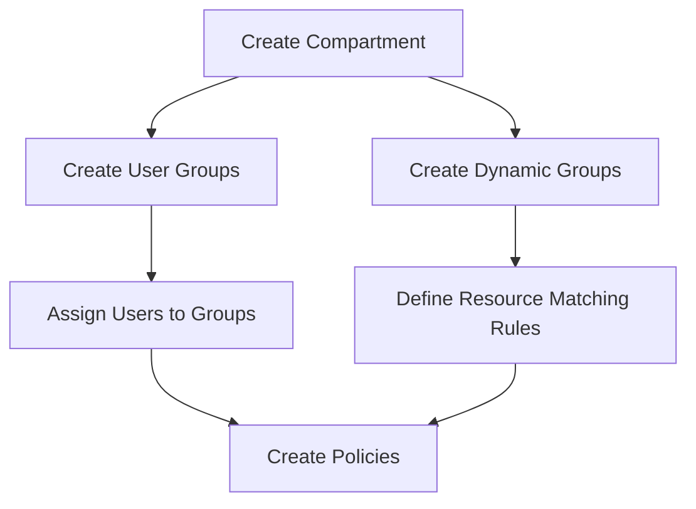

## 1. Core Configuration Components
| **Component**       | **Technical Definition**                                                                 | **Purpose in Data Science**                                                                 |
|---------------------|------------------------------------------------------------------------------------------|--------------------------------------------------------------------------------------------|
| **Compartments**    | Logical containers for organizing OCI resources with isolated access control              | Organize DS resources (notebooks, models, jobs) and enforce compartment-level security     |
| **User Groups**     | Collections of IAM users with assigned permissions                                       | Grant human users access to DS resources                                                   |
| **Dynamic Groups**  | Special groups containing *resource principals* (non-human entities) based on matching rules | Enable DS resources (notebooks/jobs/deployments) to call OCI APIs                          |
| **Policies**        | Statements granting specific permissions to principals (users/groups/resources)           | Define granular access controls for DS operations                                          |

## 2. Configuration Workflow


## 3. Component Configuration Details

### 3.1 Compartments
- **Creation Path**: 
  `OCI Console > Identity & Security > Identity > Compartments > Create Compartment`
- **Required Parameters**:
  - Name (DNS-compliant)
  - Description
  - Parent Compartment
  - Tags (optional)
- **Critical Note**: 
  - Record OCID for policy/dynamic group configuration
  - Compartment hierarchy affects policy inheritance

### 3.2 User Groups
- **User Creation**:
  - Path: `Identity > Users > Create User`
  - Parameters: Username, Description, Email
- **Group Creation**:
  - Path: `Identity > Groups > Create Group`
  - Parameters: Name, Description
- **User-Group Assignment**:
  - Path: `Group Details > Add User`

### 3.3 Dynamic Groups
- **Creation Path**: `Identity > Dynamic Groups > Create Dynamic Group`
- **Matching Rules Syntax**:
  ```plaintext
  ALL {resource_type.compartment.id = 'ocid1.compartment.oc1..<unique_ID>'}
  ```
- **Essential DS Matching Rules**:
  ```plaintext
  # Notebook sessions
  ALL {resource.type = 'datasciencenotebooksession', resource.compartment.id = 'ocid1.compartment...'}
  
  # Model deployments
  ALL {resource.type = 'datasciencedeployment', resource.compartment.id = 'ocid1.compartment...'}
  
  # Job runs
  ALL {resource.type = 'datasciencejobrun', resource.compartment.id = 'ocid1.compartment...'}
  ```

### 3.4 Policy Framework
#### Policy Syntax
```plaintext
allow <subject> to <verb> <resource-type> in <scope>
```
- **Subject Types**:
  - `group <group_name>`
  - `dynamic-group <dynamic_group_name>`
- **Verbs Hierarchy** (least to most permissive):
  1. `inspect` - List resources without metadata
  2. `read` - Inspect + access metadata/content
  3. `use` - Read + modify resources (excludes create/delete)
  4. `manage` - Full control (create/update/delete)
- **Resource Types**:
  - Granular: `datascience-model`, `datascience-job`
  - Aggregate: `data-science-family` (recommended for DS)
- **Scope**:
  - `compartment <compartment_name>`
  - `tenancy` (root level)

## 4. Essential Policies for Data Science

### 4.1 Core DS Policies
```plaintext
# User access to DS resources
allow group <data_science_user_group> to manage data-science-family in compartment <compartment_name>

# Resource principal access (dynamic group)
allow dynamic-group <ds_dynamic_group> to manage data-science-family in compartment <compartment_name>
```

### 4.2 Monitoring & Logging Policies
```plaintext
# Metrics access
allow group <ds_user_group> to read metrics in compartment <compartment_name>

# Logging permissions
allow dynamic-group <ds_dynamic_group> to use log-content in compartment <compartment_name>
allow group <ds_user_group> to manage log-groups in compartment <compartment_name>
allow group <ds_user_group> to use log-content in compartment <compartment_name>
```

### 4.3 Network Policies (for Custom VCN)
```plaintext
allow service datascience to use virtual-network-family in compartment <compartment_name>
allow group <ds_user_group> to use virtual-network-family in compartment <compartment_name>
allow dynamic-group <ds_dynamic_group> to use virtual-network-family in compartment <compartment_name>
```

### 4.4 Supplemental Service Policies
```plaintext
# Object Storage access
allow group <ds_user_group> to manage object-family in compartment <compartment_name>
allow dynamic-group <ds_dynamic_group> to manage object-family in compartment <compartment_name>

# Autonomous Database access
allow group <ds_user_group> to manage autonomous-database-family in compartment <compartment_name>
allow dynamic-group <ds_dynamic_group> to manage autonomous-database-family in compartment <compartment_name>

# Big Data Service access
allow group <ds_user_group> to manage bds-instance in compartment <compartment_name>
```

## 5. Implementation Notes
1. **Principle of Least Privilege**: Start with minimal permissions (`read`/`use`), escalate to `manage` only when required
2. **Dynamic Group Rules**: Must include exact compartment OCIDs (copy from compartment details)
3. **Policy Inheritance**: Child compartments inherit parent policies unless explicitly denied
4. **Policy Testing**: Use IAM policy simulator before production deployment
5. **Tag-Based Policies**: Optional advanced control using defined tags (e.g., `ds-project=attrition`)

## 6. Troubleshooting Checklist
- ✔️ Compartment OCID matches in dynamic group rules
- ✔️ Policies attached to correct compartment
- ✔️ Users in correct IAM groups
- ✔️ Dynamic group contains all required resource types
- ✔️ No conflicting deny policies in parent compartments