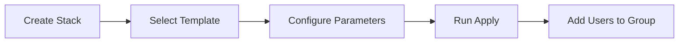

## 1. Resource Manager Template Overview
- **Preconfigured Solution**: Automates DS-specific tenancy setup
- **Created Resources**:
  - User Group (custom-named)
  - Dynamic Group (custom-named) with rules for:
    - `datasciencenotebooksession`
    - `datasciencemodeldeployment`
    - `datasciencejobrun`
  - Policy (custom-named) with:
    ```plaintext
    allow group <user_group> to manage data-science-family in compartment <compartment>
    allow dynamic-group <dynamic_group> to manage data-science-family in compartment <compartment>
    allow group <user_group> to read metrics in compartment <compartment>
    allow dynamic-group <dynamic_group> to use log-content in compartment <compartment>
    ```

## 2. Implementation Workflow


## 3. Step-by-Step Execution

### 3.1 Stack Creation
1. **Navigation Path**:  
   `OCI Console > Developer Services > Resource Manager > Stacks`
2. **Create Stack**:
   - **Template Source**: `Template`
   - **Service**: `Data Science`
   - **Template**: `Data Science Service Template`

### 3.2 Configuration Parameters
| **Parameter**         | **Required** | **Technical Description**                                                                 |
|-----------------------|--------------|-------------------------------------------------------------------------------------------|
| **Compartment**       | Yes          | Target compartment for resource creation (inherits policy scope)                          |
| **User Group Name**   | Yes          | IAM group for data scientists (e.g., `DS-Prod-Users`)                                     |
| **Dynamic Group Name**| Yes          | Resource principal group (e.g., `DS-Resource-Principals`)                                 |
| **Policy Name**       | Yes          | Policy document name (e.g., `DS-Core-Access-Policy`)                                      |
| **Region**            | Yes          | Target region for resource deployment                                                     |

### 3.3 Execution Options
- **Run Apply Immediately**: Auto-executes Terraform after creation
- **Manual Execution**: Run `terraform apply` later via Jobs interface
- **Drift Detection**: ORM continuously monitors configuration compliance

### 3.4 Post-Deployment Steps
1. **Add Users to Created Group**:
   ```bash
   oci iam group add-user --group-id <group_OCID> --user-id <user_OCID>
   ```
2. **Verify Resources**:
   - Dynamic Group: Validate resource matching rules
   - Policies: Confirm statement syntax in IAM console

## 4. Terraform Alternative
- **GitHub Repository**:  
  [https://github.com/oracle/oci-data-science-ai-samples](https://github.com/oracle/oci-data-science-ai-samples)
- **Key Files**:
  - `infrastructure/ds-core-infra.tf`: Main configuration
  - `variables.tf`: Customizable parameters
  - `outputs.tf`: Created resource identifiers

## 5. Customization Scenarios
| **Requirement**               | **Modification Point**                     |
|-------------------------------|--------------------------------------------|
| Additional Policies           | Edit `locals { policies }` block in TF     |
| Extended Dynamic Group Rules  | Modify `dynamic_group_rules` variable      |
| Network Integration           | Add `network.tf` module reference          |
| Supplemental Services         | Import ADB/Object Storage TF modules       |

## 6. Maintenance Operations
- **Update Stack**: Modify parameters via ORM console
- **Version Control**: Integrate with OCI DevOps/GitHub
- **Destruction**:
  ```bash
  oci resource-manager job create-destroy-job --stack-id <stack_OCID>
  ```

## 7. Limitations & Considerations
1. **Template Scope**: Basic DS setup only (no network/custom services)
2. **Permission Requirements**: User must have `manage all-resources` privilege
3. **Region Availability**: Verify template availability in target region
4. **Existing Groups**: Will not modify pre-existing IAM groups
5. **Tag Propagation**: Requires manual tag configuration in variables

## 8. Troubleshooting Guide
| **Issue**                            | **Resolution**                                                                 |
|--------------------------------------|--------------------------------------------------------------------------------|
| Policy creation failure              | Verify IAM permission inheritance in compartment hierarchy                    |
| Dynamic group resources not matching | Check compartment OCID in matching rules                                      |
| Terraform apply errors               | Inspect logs in `Resource Manager > Jobs > Logs`                              |
| Missing metrics/logs                 | Validate supplemental policies for monitoring services                         |
