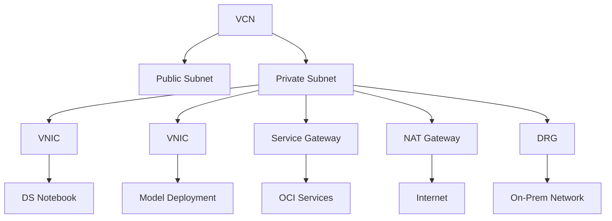
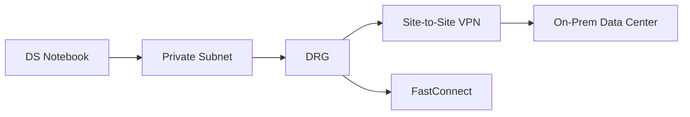

## 1. Core Networking Components
| **Component**                     | **Technical Definition**                                                        | **Data Science Relevance**                                                             |
| --------------------------------- | ------------------------------------------------------------------------------- | -------------------------------------------------------------------------------------- |
| **Virtual Cloud Network (VCN)**   | Software-defined private network within OCI region                              | Isolated environment for DS workloads (notebooks/jobs/deployments)                     |
| **Subnets**                       | Segmented IP address ranges within VCN (public/private)                         | Security zoning for DS resources; unit of configuration (route tables, security lists) |
| **Virtual NIC (VNIC)**            | Virtual network interface attached to compute instances                         | Network interface for DS workloads (secondary VNIC attachment model)                   |
| **Dynamic Routing Gateway (DRG)** | Virtual router for private connectivity to on-premises/other VCNs               | Hybrid connectivity for on-prem data access                                            |
| **NAT Gateway**                   | Enables outbound internet access for private resources without inbound exposure | Secure internet egress for package installation/data access                            |
| **Service Gateway**               | Private connectivity path to OCI services (Object Storage, ADB, etc.)           | Secure access to OCI services without public internet traversal                        |

## 2. Network Architecture


## 3. Data Science Networking Modes

### 3.1 Default Networking
- **Configuration**: Service-managed VCN/subnet
- **Connectivity**:
  - Outbound internet via NAT gateway
  - OCI services via service gateway
- **Use Cases**:
  - Public package installation (PyPI)
  - Accessing public datasets
  - OCI service interaction
- **Limitations**: 
  - No private network access
  - No inbound connections
  - No custom security rules

### 3.2 Custom Networking (BYO-VCN)
- **Configuration**: User-provided subnet
- **Connectivity**:
  - Full VCN-defined network paths
  - Hybrid access via DRG
  - Private service endpoints
- **Required Policies**:
  ```plaintext
  allow service datascience to use virtual-network-family in compartment <compartment>
  allow group <ds_group> to use virtual-network-family in compartment <compartment>
  allow dynamic-group <ds_dynamic_group> to use virtual-network-family in compartment <compartment>
  ```
- **Critical Use Cases**:
  - On-premises data access
  - Private Git repositories
  - Enterprise security compliance
  - VCN peering between compartments

## 4. Implementation Guide

### 4.1 VCN Creation via Wizard
1. **Navigation Path**:  
   `Networking > Virtual Cloud Networks > Start VCN Wizard`
2. **Template Selection**:  
   `Create VCN with Internet Connectivity`
3. **Configuration**:
   - VCN Name: `ds-vcn`
   - CIDR Block: `10.0.0.0/16` (recommended)
   - Public Subnet: `10.0.0.0/24`
   - Private Subnet: `10.0.1.0/24`
4. **Auto-Created Resources**:
   - Internet Gateway (public)
   - NAT Gateway (private)
   - Service Gateway (private)
   - Route tables with default routes
   - Security lists with baseline rules

### 4.2 DS Workload Attachment
- **Notebook Sessions**:
  ```python
  # During creation in OCI Console
  Networking Type: Custom
  Virtual Cloud Network: ds-vcn
  Subnet: private-subnet
  ```
- **Model Deployments**:
  - Same VCN/subnet selection during deployment
  - Requires security list updates for HTTP/HTTPS ingress

### 4.3 Security Configuration
| **Requirement**              | **Security List Rule**                                                                 |
|------------------------------|----------------------------------------------------------------------------------------|
| **Outbound Package Access**  | Egress: TCP 443 to 0.0.0.0/0 (PyPI/conda)                                              |
| **Private Git Access**       | Egress: TCP 22/443 to on-prem CIDR                                                     |
| **Model Endpoint Access**    | Ingress: TCP 80/443 from allowed CIDRs                                                 |
| **VCN Peering**              | Ingress/Egress rules for peered VCN CIDRs                                              |

## 5. Advanced Configurations

### 5.1 Hybrid Connectivity


### 5.2 Service Gateway Endpoints
- **Object Storage**: `*.objectstorage.<region>.oci.customer-oci.com`
- **Autonomous DB**: `*.adb.<region>.oci.customer-oci.com`
- **Configuration**:
  ```plaintext
  # Route Table Entry
  Destination: Object Storage CIDR
  Target: Service Gateway
  ```

## 6. Troubleshooting Checklist
- ✔️ VCN flow logs enabled for traffic inspection
- ✔️ Security list rules allow required protocols
- ✔️ Route tables point to correct gateways
- ✔️ Network Security Groups (NSGs) not blocking traffic
- ✔️ DRG attachments in correct states
- ✔️ DNS resolution configured for private endpoints